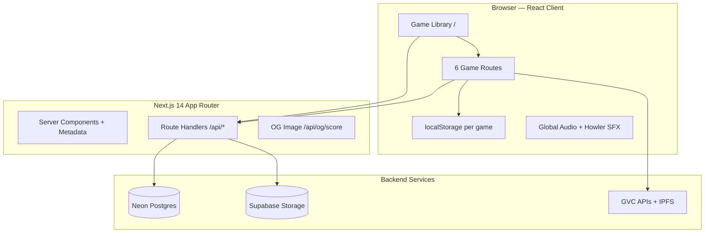
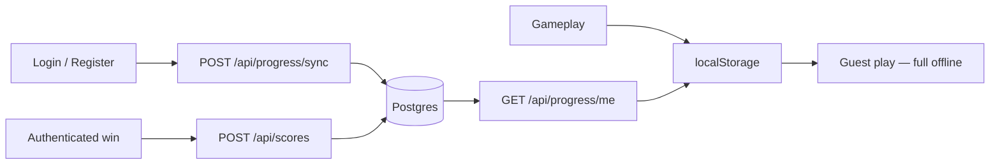

# Vibe Night — Site Architecture

**Vibe Night** (repo name `vibe-sling`) is a **Good Vibes Club (GVC) arcade hub**: one Next.js app, one optional account, shared leaderboards and profile identity, and **six browser games**. Gameplay runs almost entirely in the browser; Postgres (Neon) and Supabase back accounts, scores, and rich profile assets.

---

## High-level topology



| Layer | Role |
|--------|------|
| **Presentation** | Next.js App Router pages, shared arcade shell, Framer Motion, Tailwind + GVC design tokens |
| **Game logic** | Pure TS modules per title (`lib/vibe-*`, `lib/catch-a-vibe`, etc.) — mostly client-only |
| **Persistence** | `localStorage` first; optional cloud via authenticated APIs |
| **API** | Next.js Route Handlers (`app/api/**`) on Node runtime |
| **Primary DB** | Postgres via `pg` — users, sessions, scores, progress, profile |
| **Object storage** | Supabase — passports, dev screenshots |
| **External** | GVC metadata API, brand library, CoinGecko/DexScreener (referenced in docs), IPFS gateways |

---

## Tech stack

| Category | Technology |
|----------|------------|
| Framework | Next.js 14 (App Router), React 18, TypeScript |
| Styling | Tailwind CSS, GVC tokens in `app/globals.css` (gold `#FFE048`, black `#050505`, Brice/Mundial fonts) |
| Motion | Framer Motion |
| Physics | Matter.js (Vibe Crashers, Big Vibes, Vibe Garden, Catch A Vibe) |
| Audio | Howler (SFX in `lib/sounds.ts`), custom music engine (`lib/audio/engine.ts`) |
| Database | `pg` + `DATABASE_URL` (Neon pooled URL in production) |
| Object storage | `@supabase/supabase-js` for passports and marketing assets |
| Auth | Username + password (`bcryptjs`), httpOnly session cookies, SHA-256 hashed tokens in DB |
| Observability | Sentry (`@sentry/nextjs`, `instrumentation.ts`) |
| OG images | `satori` + `sharp` at `/api/og/score` |

---

## Application structure

### Routing (`app/`)

| Route | Purpose |
|-------|---------|
| `/` | Game library hub (`GameLibraryPage`) |
| `/vibe-crashers` | Vibe Crashers (slingshot) |
| `/vibe-merge` | Big Vibes (merge) |
| `/vibe-garden` | Vibe Garden (ecosystem) |
| `/catch-a-vibe` | Catch A Vibe (swipe arcade) |
| `/vibe-shift` | Vibe Shift (slide-match) |
| `/lucky-vibes` | Lucky Vibes (slot) |
| `/profile/[username]` | Public profile + passport |
| `/badges` | GVC badge gallery |
| `app/api/*` | REST-style handlers (auth, scores, progress, profile, health, IPFS proxy) |

Each game route is a thin client page that wraps a **ClientGate** inside `GameRouteShell`:

```tsx
// app/vibe-crashers/page.tsx (pattern shared by all games)
"use client";
import GameClientGate from "@/components/game/GameClientGate";
import { GameRouteShell, useExitToLibrary } from "@/components/library/GameRouteShell";

export default function VibeCrashersPage() {
  const exitToLibrary = useExitToLibrary();
  return (
    <GameRouteShell>
      <GameClientGate onExitToLibrary={exitToLibrary} />
    </GameRouteShell>
  );
}
```

### Root shell

`app/layout.tsx` loads fonts, `SiteBackdrop`, and wraps everything in **`VibeNightShell`**:

- **`VibeNightProviders`** — `AuthProvider` + `GlobalAudioProvider`
- **`ArcadeMusicPlayer`** — site-wide soundtrack UI
- **`ArcadeDebugOverlay`** — gated on `?debug=1`
- **`react-hot-toast`** Toaster

The hub catalog is centralized in `lib/games/catalog.ts` (`GAME_LIBRARY`, `GameId`, `gameRoutePath()`).

---

## Frontend architecture

### Shared arcade UX

Documented in `docs/ARCADE-UX.md`. Reusable pieces live under `components/arcade/` and `components/game/`:

| Component / module | Role |
|--------------------|------|
| `ArcadeTitleShell` | Unified title screen chrome |
| `ArcadeEmberBackdrop` | Floating gold embers |
| `ArcadeSecondaryGrid` | Leaders / Goals / Collection / Settings |
| `ArcadeLeaderboardPanel` | Classic + daily leaderboard tabs |
| `UnifiedAchievementPanel` | Locked/unlocked achievement list |
| `FirstRunCoachOverlay` | Skippable first-run tips |
| `gamePanelStyles.ts` | Shared panel style tokens |
| `lib/arcade/onboarding.ts` | Per-game first-run (`vibe-night:onboarded:{gameId}`) |
| `lib/arcade/nightStreak.ts` | Cross-game daily streak |
| `lib/arcade/share.ts` | Share text, Twitter intent, OG URLs |

### Client-only game bundles (ClientGate pattern)

Heavy game code (Matter.js, canvas loops) must not run in the RSC graph. Each title has a gate component that:

1. Mounts only in the browser
2. **`import()`** the real game module with chunk-load retries
3. Wraps render in an error boundary with “Try again” / reload guidance

Example: `components/game/GameClientGate.tsx` → `VibeSlingGame.tsx`.

This keeps initial HTML light and avoids SSR crashes from `window` / canvas APIs.

### State management philosophy

- **No global Redux.** Game state lives in React state inside game components, backed by **pure functions** in `lib/*` (engines, scoring, achievements).
- **Cross-session state** — per-game `*Storage.ts` modules writing to `localStorage` with namespaced keys.
- **Account mode** — `lib/persist/accountMode.ts`, `accountCache.ts`, `cloudSync.ts` debounce-sync to `/api/progress/sync` after login.

---

## The six games

| Game | `gameId` | Engine / loop | Modes |
|------|----------|---------------|--------|
| **Vibe Crashers** | `vibe-crashers` | Matter.js slingshot; 20 handcrafted levels in `lib/handcrafted-levels-data.ts` | Level, Daily, Practice |
| **Big Vibes** | `vibe-merge` | Matter.js drop-merge stack | Classic, Daily |
| **Vibe Garden** | `vibe-garden` | Tap-to-plant ecosystem physics | Classic, Daily, Zen |
| **Catch A Vibe** | `catch-a-vibe` | Swipe catch arcade | Classic, Daily, Zen |
| **Vibe Shift** | `vibe-shift` | 8×8 slide-match puzzle (`lib/vibe-shift/shiftEngine.ts`) | Classic (10 levels), Daily |
| **Lucky Vibes** | `lucky-vibes` | 6×5 ways slot (`lib/lucky-vibes/luckyEngine.ts`) | Classic, Daily, Zen |

Each game typically has:

- `*Config.ts` — constants, `GAME_ID`, modes
- `*Engine.ts` or physics world builders — deterministic logic
- `*Storage.ts` — local persistence (bests, achievements, goals)
- `*Achievements.ts` / goals definitions
- `*ClientGate.tsx` — dynamic import boundary
- Game-specific UI under `components/game/` or subfolders (e.g. `catch-a-vibe/`)

### Daily seeds

`lib/daily-seed.ts`:

- `todaySeed()` returns `YYYY-MM-DD` in `America/New_York`
- `seededRandom(seed)` drives deterministic boards/drops
- URL `?seed=` overrides for sharing

### Vibe Crashers physics pipeline

1. Level data → `lib/physics/createWorld.ts` (Matter bodies, settle pass)
2. Materials from `lib/physics/materials.ts`
3. Collisions / breakables in `lib/physics/collisions.ts`
4. Canvas paint in `lib/board/matterBoardPaint.ts`
5. Scoring in `lib/scoring.ts` (combos, par bonus, stars per level thresholds)

---

## Data architecture: local-first, cloud-merge



| Concern | Guest | Logged-in |
|---------|-------|-----------|
| Play all games | Yes | Yes |
| Best scores, achievements, goals | `localStorage` | Local + server merge (never downgrade server bests) |
| Leaderboard submit | Local fallback rows only | `POST /api/scores` |
| Profile, titles, cosmetics | N/A | Postgres `user_profiles`, `user_titles`, etc. |
| Passport image | N/A | Generated → Supabase; URL on profile |

`AuthContext` on boot calls `/api/auth/me`, hydrates profile via `/api/profile/me`, and triggers progress sync after register/login using `buildProgressSyncPayload()` + per-game extras from `lib/profile/syncMerge.ts`.

---

## Backend API surface

All handlers are Next.js Route Handlers under `app/api/`.

### Auth (`/api/auth/*`)

| Endpoint | Purpose |
|----------|---------|
| `POST /api/auth/register` | Create account (username + password) |
| `POST /api/auth/login` | Issue session cookie |
| `POST /api/auth/logout` | Clear session |
| `GET /api/auth/me` | Current user + DB availability flag |

Session: random token → **SHA-256** stored in `sessions`; httpOnly cookie (`AUTH_COOKIE_NAME`, default `vibe_crashers_session`).

Key modules: `lib/session.ts`, `lib/auth.ts`, `lib/password.ts`.

### Scores (`/api/scores`)

**GET** — query params:

- `gameId` (default `vibe-crashers`)
- `scope`: `daily` | `weekly` | `alltime`
- `mode`: per-game (`level`/`daily` for Crashers; `classic`/`daily` for others)
- optional `levelId`, `seed`, `limit`, `includeMe`

**POST** — authenticated; validates per-game payload; rate limit by IP; optional **move replay** anti-cheat.

Replay verification (`lib/scoreReplay.ts`) is required for **Vibe Shift**, **Lucky Vibes**, and **Vibe Crashers** (server re-runs `moves_json` against seed and compares score). Other arcade titles validate bounds/metadata without full Matter replay today.

### Progress (`/api/progress/me`, `/api/progress/sync`)

Merges Crashers level/daily progress, achievements, goals, settings, and cross-game stats from all six titles.

### Profile (`/api/profile/*`)

| Endpoint | Purpose |
|----------|---------|
| `GET /api/profile/me` | Equipped title, cosmetics, streak, tier |
| `GET/POST /api/profile/me/passport` | Generate/upload passport via Supabase |
| `GET /api/profile/me/collections` | Badge/title collections |
| `GET /api/profile/me/activity` | Activity feed |
| `GET /api/profile/[username]` | Public profile read |

### Utilities

| Endpoint | Purpose |
|----------|---------|
| `GET /api/health` | Deploy health check |
| `GET /api/ipfs-proxy` | Same-origin IPFS for GVC token images |
| `GET /api/gvc-metadata` | Metadata proxy/cache |
| `POST /api/streaks/bump` | Play streak updates |
| `GET /api/og/score` | Dynamic share cards (`game`, `name`, `score`, `mode`) |

---

## Database schema (`lib/db.ts`)

Created idempotently via `ensureTables()` (dev/runtime when `ALLOW_RUNTIME_MIGRATIONS`) or `npm run migrate` (production).

### Core tables

| Table | Purpose |
|-------|---------|
| `users` | Username + password hash (no email) |
| `sessions` | SHA-256 session token hashes, expiry |
| `leaderboard_scores` | All games; `game_id`, `mode`, `level_id`, `seed`, `score`, `moves_json`, `run_hash` |
| `user_level_progress` | Per-level bests (Crashers) |
| `user_daily_progress` | Per daily-seed bests |
| `user_achievements` | Scoped by `game_id` |
| `user_goals` | Scoped by `game_id` |
| `user_settings` | Projectile skin, sound prefs |

### Profile / identity tables

| Table | Purpose |
|-------|---------|
| `user_profiles` | Equipped title, cosmetics, tier, passport URL |
| `user_streaks` | Current/longest play streak |
| `user_titles` | Unlocked display titles |
| `user_unlocked_cosmetics` | Themes, borders, glows, etc. |
| `user_pinned_badges` | Profile badge slots |
| `user_game_stats` | JSONB per-game aggregate stats |
| `user_activity` | Event log for profile feed |

Leaderboard time windows use **America/New_York** SQL fragments (`sqlNyDayStart`, `sqlNyWeekStart`).

If `DATABASE_URL` is unset, the app **builds and runs** in guest mode; API routes return 503 with clear JSON errors.

---

## Profile & identity layer

Beyond raw scores, logged-in users get a **cross-game identity**:

- **Titles** — `lib/profile/titles/` (game-specific + meta titles, unlock logic)
- **Cosmetics** — themes, borders, glows, backgrounds, particles (`lib/profile/catalog.ts`)
- **Arcade tier / vibe rank** — derived from achievements, streaks, activity (`lib/profile/identityScore.ts`, `lib/profile/unlocks.ts`)
- **Passport** — rendered image (`lib/passport/renderPassportImage.tsx`) stored in Supabase (`lib/supabase/storage.ts`)
- **Public profile page** — `/profile/[username]` with hero, stats, badge pins, title collection

Unlock evaluation runs after score submit (`evaluateAndPersistUnlocks`, `recordActivity`, `reconcileProfileAchievements`).

---

## GVC asset integration

Static and fetched GVC data power visuals without wallet connection:

| Asset | Location / access |
|-------|-------------------|
| All 6,969 token metadata | `public/gvc-metadata.json` + `/api/gvc-metadata` |
| Badge ↔ token mapping | `public/badge_token_map.json`, `lib/badge-helpers.ts` |
| Brand badge URLs | `public/gvc-brand-badges.json` → `lib/gvcRewardBadges.ts` |
| Level backgrounds, faces, projectile skins | `lib/assets/*` |
| IPFS images | `/api/ipfs-proxy` + gateway fallbacks in `lib/assets/ipfs.ts` |
| External stats | GVC API at `https://api-hazel-pi-72.vercel.app/api` |

Achievement/goal UI maps in-game slugs to official library badge art for toasts and panels.

---

## Audio architecture

Two parallel systems:

1. **Global soundtrack** — `GlobalAudioContext` → `lib/audio/engine.ts` with zones (`lib/audio/audioTransitions.ts`), track list in `lib/audio/soundtrack.ts`, persistence in `lib/audio/audioPersistence.ts`. UI: `ArcadeMusicPlayer`, mini/expanded player components.

2. **Game SFX** — `lib/sounds.ts` (Howler catalog) with mute/volume in localStorage; respects `prefers-reduced-motion` for auto-BGM policy.

`hooks/useArcadeAudioZone.ts` switches music mood between hub vs in-game.

---

## Security & integrity

- Passwords hashed with bcrypt; sessions store **hashed** tokens only
- Score POST rate limiting (`lib/rateLimit.ts`)
- Payload validation per game (`lib/scoreValidation.ts`, `*ScoreValidation.ts`)
- Replay anti-cheat for selected games via deterministic engines
- Duplicate run suppression via `run_hash` (~15 min window)
- IPFS proxy avoids exposing clients to mixed gateway failures

Wallet login is explicitly **future work** (see `README.md`).

---

## Observability & deployment

- **Sentry** — client, server, and edge configs; loaded from `instrumentation.ts`
- **CI** — GitHub Actions: lint + build (`.github/workflows/ci.yml`)
- **Deploy checklist** — `DATABASE_URL`, `NEXT_PUBLIC_APP_URL`, Supabase keys; `npm run migrate` once per deploy; optional `npm run upload:screenshots`
- **Dev ergonomics** — `npm run dev:clean` fixes common `/_next/static/chunks` 404 from port conflicts

### Environment variables

| Variable | Purpose |
|----------|---------|
| `DATABASE_URL` | Neon Postgres connection string |
| `AUTH_COOKIE_NAME` | Session cookie name (optional) |
| `AUTH_SESSION_DAYS` | Session lifetime (optional) |
| `NEXT_PUBLIC_APP_URL` | Production domain (OG + passport links) |
| `SUPABASE_URL` | Supabase project URL |
| `SUPABASE_SERVICE_ROLE_KEY` | Passport + asset bucket access |
| `ALLOW_RUNTIME_MIGRATIONS` | Allow DDL on API hit (dev only recommended) |

---

## Project directory map (high level)

```
app/                    # Next.js App Router pages + API routes
components/
  arcade/               # Shared arcade UI (leaderboards, achievements, shell)
  audio/                # Global music player
  game/                 # Per-game UI + ClientGates
  library/              # Hub / game library
  profile/              # Profile page components
contexts/               # AuthProvider, GlobalAudioContext
hooks/                  # useAuth, useArcadeAudioZone, usePostRun, etc.
lib/
  games/                # Game catalog
  physics/              # Matter.js (Crashers)
  vibe-merge/           # Big Vibes engine + storage
  vibe-garden/          # Vibe Garden
  catch-a-vibe/         # Catch A Vibe
  vibe-shift/           # Vibe Shift
  lucky-vibes/          # Lucky Vibes
  profile/              # Identity, titles, unlocks
  persist/              # Cloud sync, account cache
  audio/                # Music engine
  db.ts                 # Postgres pool + schema
docs/                   # Game-specific + this file
public/                 # Static assets, gvc-metadata.json, fonts, sounds
scripts/                # migrate, tests, screenshots upload
```

---

## Key design patterns

1. **Hub + spokes** — one catalog, one auth, many isolated game modules.
2. **ClientGate** — code-split browser-only game bundles with resilient chunk loading.
3. **Pure game engines** — testable TS outside React; daily determinism via seeded PRNG.
4. **localStorage-first, cloud-merge-up** — guests never blocked; accounts sync without clobbering server bests.
5. **Multi-tenant leaderboards** — single `leaderboard_scores` table keyed by `game_id` + `mode` + time scope.
6. **Shared arcade chrome** — consistent HUD, modals, share, onboarding across titles.
7. **Optional backend** — Postgres and Supabase enhance the experience but are not required to play.

---

## Related documentation

| File | Contents |
|------|----------|
| `README.md` | How to play, scoring, env setup, scripts |
| `CLAUDE.md` | GVC brand system, API contracts, code patterns |
| `docs/ARCADE-UX.md` | Shared shell, HUD, share, onboarding |
| `docs/BIG-VIBES.md` | Big Vibes tuning and API |
| `docs/VIBE-GARDEN.md` | Vibe Garden |
| `docs/CATCH-A-VIBE.md` | Catch A Vibe |
| `docs/VIBE-SHIFT.md` | Vibe Shift |
| `docs/LUCKY-VIBES.md` | Lucky Vibes |
| `docs/GAMEPLAY-BALANCE.md` | Crashers level tuning |

---

*Generated for the vibe-sling / Vibe Night codebase.*
